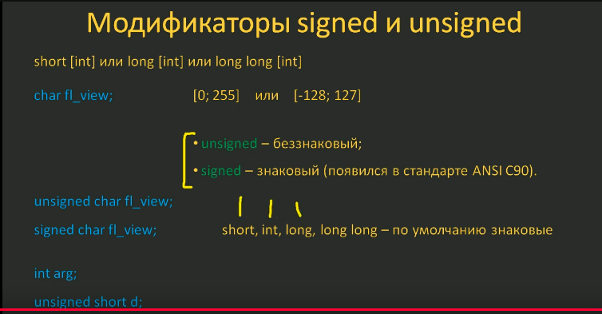
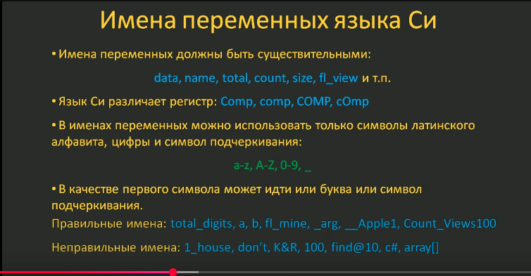
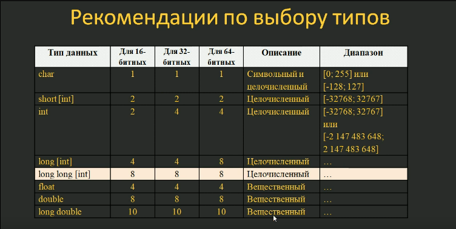
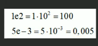

# Конспектик 

17.06.25 
---

1. написал пример кода c видео курса для вывода hello world 

2. В самом простом случае чтобы скомпилировать эту программу 
(ctrl + ~ open terminal in vscode) прописываю `gcc lessons1.c` появляется исполняемый файл a.out (на видео виндовс у него экзе)

3. Установил расширение с/с++, скомпилировал через дебаг

4. установил код раннер чтобы выполнить ctrl + alt + N

5. настроил -std=cc99  in tasks.json и перекомпилировал ctrl + shift + B

6. Настраиваю код раннер через настройки вывел себе settings.json и добавил туда кеонфигурации executotMap
---

18.06.25
-

---

---

